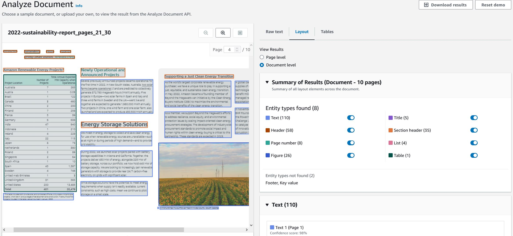
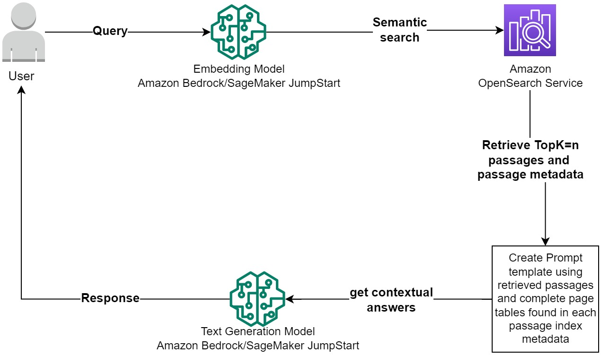

# Layout-Aware-Document-Extraction-Chunking-and-Indexing
Prerequisite:
- [Amazon Bedrock model access](https://docs.aws.amazon.com/bedrock/latest/userguide/model-access.html)
- [Deploy Embedding and Text Generation Large Language Models with SageMaker JumpStart](https://docs.aws.amazon.com/sagemaker/latest/dg/jumpstart-foundation-models-use.html)
- [Create OpenSearch Domian](https://docs.aws.amazon.com/opensearch-service/latest/developerguide/createupdatedomains.html). This solution uses **IAM** as master user for fine-grained access control.

This sample notebook walks you through how you can leverage Amazon Textract layout feature to extract contents from your document while preserving the layout and reading format of the document. Amazon Textract Layout feature is able to detect the following sections:
- Titles
- Headers
- Sub-headers
- Text
- Tables
- Figures
- List 
- Footers
- Page Numbers
- Key-Value pairs

Here is a snippet of Textract Layout feature on a page of Amazon Sustainability report using the Textract Console UI:

You can try out the textract service from your AWS account by navigating to the Amazon Textract console.

The [Amazon Textract Textractor Library](https://aws-samples.github.io/amazon-textract-textractor/index.html) is a library that seamlessly works with Textract features to aid in document processing. You can start by checking out the [examples in the documentation.](https://aws-samples.github.io/amazon-textract-textractor/notebooks/layout_analysis_for_text_linearization.html)
This notebook makes use of the Textractor library to call Amazon Textract and process the response from Amazon Textract. Enriches the extracted document text with xml tags to identify sections which makes it easy for layout-aware chunking and document indexing into a vector database to improve Retrieval Augmented Generation (RAG) performance.
It also walks you through sample Generative-AI usecases that can be improved with better document extraction and enrichment.

## DOCUMENT PROCESSING AND INDEXING

1. Upload multi-page document to Amazon S3
2. Call Amazon Textract Start Document Analysis api call to extract Document Text including Layout and Tables. The response from this api call is the layout organized text and the pandas tables of each table detected in the document.
3. Using the Textractor library, enrich certain sections of the document with xml tags for layout aware document text processing.
4. The textrcat library extracts the table in plain text while preserving each cells geometry and the table layout. However, to better process and wrangle the tables its better to convert them to their csv formats. I replace the plain text tables with their csv format gotten from the Textract tables feature.
5. Chunking documents with structured text has been critical issue when processing text for RAG systems. A variety of solutions have been proposed including chunking documents per page to avoid dealing with tables, Indexing the CSV tables seperately from the document text etc. In this solution walks you through how you can intelligently chunk tables and list items in your document together with the surrounding free text while preserving the structure of the table and list items.- This solutions uses max number of words to set the treshold for chunking. This is made possible using the xml tag (you can choose any other section annotations) document text enrichment which Textract provides using the Textrcator library.
    - **Tables:** Tables are chunked by table rows until the max number of alphanumeric words are reached. For each table chunk, the column headers are appended to the table and also the table title (usually the sentence preceding the table in the document) to preserve the information of the table in each chunk.
    
    
    
    - **List:** List found in documents can be tricky to chunk. Naive chunking splist the list items by sentence or new line char, However only the first list chunk contains the list title (usually the sentence before the list) which provides inforamtion to the list items. Therefore, the succeeding list chunks become obselete. In this notebook lists are chunk by their list items and the title of the list are appended to each list chunk to preserve the information of the list in each of the chunks.
    
    
    - **Titles:** A lot of information can be added to each page chunk if the title of the page (if available) is added to each chunk. For each chunk in a page, the page title is appended to the chunk.
6. To bolster the above table chunking startegy above, and provide as much needed context to the Large Language Model (LLM), the complete tables in each page are added as index metadata for each chunk in that page. When a passage is retrieved the addtional table metadata included in the page that passaage can be provided to the response LLM as additional context. This is especially helpful in topk=1 retrieved passage that are passed to the LLM and also when dealing with complex tables.

## RETRIEVAL AUGMENTED GENERATION

During RAG, we get the topK=n similar passages from the Vector DataBase (Amazon OpenSearch). A prompt template is created which includes the retrieved passage(s) and passage index table metadata for all tables in the page(s) the passage(s) are found. This provides more information to the LLM especially for queries involving tables. The same approach can be carried out for list items found in pages.
